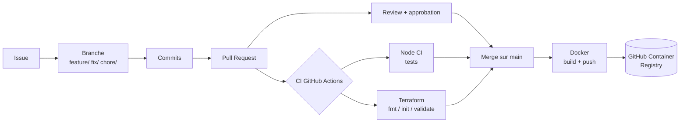

# DevOps Platform Challenge

Petite API Node.js de gestion de tâches, utilisée comme support pour mettre en place une **plateforme de développement professionnelle** : workflow GitHub, intégration continue, conteneurisation Docker et validation Terraform.

L'objectif n'est pas l'application elle-même, mais tout ce qui l'entoure : chaque modification passe par une issue, une branche, une Pull Request relue et des contrôles automatiques avant d'arriver sur `main`.

---

## Sommaire

- [Architecture](#architecture)
- [Structure du projet](#structure-du-projet)
- [Installation locale](#installation-locale)
- [Tests et qualité du code](#tests-et-qualité-du-code)
- [API](#api)
- [Docker](#docker)
- [CI/CD](#cicd)
- [Terraform](#terraform)
- [Workflow de développement](#workflow-de-développement)
- [Commandes utiles](#commandes-utiles)
- [Équipe](#équipe)

---

## Architecture



- **Application** : API REST en Node.js avec Express, données stockées en mémoire.
- **Tests** : exécutés avec le module natif `node:test`.
- **CI/CD** : GitHub Actions (tests Node.js, validation Terraform, image Docker).
- **Conteneur** : image Docker publiée sur GitHub Container Registry (GHCR).
- **Infrastructure** : code Terraform validé en CI, sans fournisseur cloud ni déploiement.

---

## Structure du projet

```text
.
├── .github/
│   ├── ISSUE_TEMPLATE/         # Templates d'issue (bug, feature)
│   ├── workflows/              # Workflows GitHub Actions
│   │   ├── node-ci.yml
│   │   ├── terraform.yml
│   │   └── docker.yml
│   └── pull_request_template.md
├── src/
│   └── app.js                  # Application Express
├── test/
│   └── app.test.js             # Tests automatisés
├── terraform/
│   └── main.tf                 # Configuration Terraform
├── Dockerfile
├── .dockerignore
├── eslint.config.mjs
├── package.json
└── README.md
```

---

## Installation locale

**Prérequis** : Node.js 22 et npm. Docker et Terraform sont facultatifs pour un usage local.

```bash
git clone https://github.com/Davinoildevert/Challenge-Platform.git
cd Challenge-Platform
npm install
npm start
```

L'application écoute sur le port **3000** : http://localhost:3000

Le port peut être modifié avec la variable d'environnement `PORT`.

---

## Tests et qualité du code

```bash
npm test        # lance tous les tests automatisés
npm run lint    # vérifie la qualité du code avec ESLint
```

Les tests démarrent un vrai serveur sur un port libre et envoient des requêtes HTTP aux routes de l'API. Ils couvrent les cas de succès et les cas d'erreur (400, 404).

**Règle d'équipe** : aucun test n'est supprimé ou affaibli pour rendre la CI verte.

---

## API

| Méthode | Route | Description | Réponses |
|---|---|---|---|
| GET | `/` | Informations sur le service | 200 |
| GET | `/health` | Vérification de l'état du service | 200 |
| GET | `/total` | Calcul du total d'un panier d'exemple | 200 |
| GET | `/tasks` | Liste toutes les tâches | 200 |
| POST | `/tasks` | Crée une tâche : `{ "title": "..." }` | 201, 400 si le titre est vide |
| PATCH | `/tasks/:id` | Marque une tâche comme terminée : `{ "completed": true }` | 200, 400 si l'entrée est invalide, 404 si la tâche n'existe pas |
| DELETE | `/tasks/:id` | Supprime une tâche | 204, 404 si la tâche n'existe pas |

Chaque tâche a la forme suivante :

```json
{
  "id": 1,
  "title": "Write README",
  "completed": false
}
```

Les tâches sont stockées **en mémoire** : elles sont perdues au redémarrage de l'application.

---

## Docker

Construire l'image :

```bash
docker build -t devops-platform-challenge .
```

Lancer le conteneur :

```bash
docker run --rm -p 3000:3000 devops-platform-challenge
```

L'application est alors disponible sur http://localhost:3000.

Le fichier `.dockerignore` exclut les fichiers inutiles de l'image (`node_modules`, `.git`, etc.) pour la garder légère.

L'image est aussi publiée automatiquement sur **GitHub Container Registry** par le workflow `docker.yml` (voir ci-dessous).

---

## CI/CD

Trois workflows GitHub Actions automatisent les contrôles :

| Workflow | Fichier | Déclencheur | Ce qu'il fait |
|---|---|---|---|
| **Node CI** | `node-ci.yml` | Chaque Pull Request et chaque push sur `main` | Installe Node.js 22 et les dépendances, puis lance `npm test` |
| **Terraform** | `terraform.yml` | PR et push sur `main` modifiant `terraform/` | Lance `terraform fmt -check`, `terraform init` et `terraform validate` |
| **Docker** | `docker.yml` | Push sur `main` | Construit l'image, se connecte à GHCR, la tague et la publie |

### Quality gates

La branche `main` est **protégée** :

- impossible de pousser directement sur `main` ;
- une Pull Request est obligatoire ;
- au moins **1 approbation** est requise avant le merge ;
- les contrôles CI doivent réussir avant le merge.

Résultat : du code qui casse un test ne peut pas être mergé. Cela a été démontré en ouvrant une PR qui faisait volontairement échouer un test (CI rouge, merge bloqué), puis en la corrigeant (CI verte, approbation, merge possible).

---

## Terraform

Le dossier `terraform/` contient une configuration simple : une variable `application_name`, des métadonnées locales (application et environnement) et une sortie `application_metadata`.

**Aucun fournisseur cloud n'est utilisé** : rien n'est déployé. Terraform sert ici à montrer comment le code d'infrastructure est contrôlé automatiquement comme le reste du code.

Le workflow `terraform.yml` vérifie que le code :

1. est correctement formaté (`terraform fmt -check`) ;
2. s'initialise sans erreur (`terraform init -backend=false`, sans stockage distant) ;
3. est valide (`terraform validate`).

Pour vérifier en local (Terraform 1.5 ou plus) :

```bash
cd terraform
terraform fmt -check
terraform init -backend=false
terraform validate
```

---

## Workflow de développement

1. **Créer une issue** à partir d'un template (bug ou feature), avec le comportement attendu et les critères d'acceptation.
2. **Créer une branche** depuis `main` :
   - `feature/...` pour une nouvelle fonctionnalité ;
   - `fix/...` pour une correction de bug ;
   - `chore/...` pour une tâche technique (CI, configuration, documentation).
3. **Faire des commits clairs**, qui décrivent ce qu'ils font (par exemple `Add PATCH /tasks/:id endpoint to complete a task`), et non `update` ou `final`.
4. **Ouvrir une Pull Request** avec le template : issue liée (`Fixes #n`), changements, tests effectués, checklist.
5. **Review** par un autre membre de l'équipe, avec au moins une remarque technique utile, puis approbation.
6. **Merge** une fois la CI verte et la PR approuvée. La branche est ensuite supprimée.

---

## Commandes utiles

| Commande | Rôle |
|---|---|
| `npm install` | Installer les dépendances |
| `npm start` | Démarrer l'application |
| `npm test` | Lancer les tests |
| `npm run lint` | Vérifier le code avec ESLint |
| `docker build -t devops-platform-challenge .` | Construire l'image Docker |
| `docker run --rm -p 3000:3000 devops-platform-challenge` | Lancer le conteneur |
| `terraform fmt -check` | Vérifier le formatage Terraform |
| `terraform validate` | Valider la configuration Terraform |
| `git checkout -b feature/nom` | Créer une branche de travail |
| `git pull` | Récupérer les dernières modifications |

---

## Équipe

| Membre | Responsabilités principales |
|---|---|
| Davinoildevert | Workflow GitHub (templates, protection de `main`), correction du bug, Node CI |
| Josi05 | Docker et pipeline de conteneur, `POST /tasks` |
| gnimavolauriane-lgtm | Workflow Terraform, `PATCH /tasks/:id`, documentation |

Chaque membre a relu au moins une Pull Request d'un autre membre.

